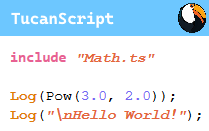

# TucanScript

Simple scripting engine with binary tools

## About
- This language elegantly harmonizes the precision of low-level systems programming with the safety of modern high-level abstractions. Designed for versatile development, it empowers programmers to:
  - Dive into raw, unmanaged code when needed, with direct access to memory, pointer arithmetic, and hardware-level operations (C-like control),
  - Operate within a managed, safety-first environment for everyday tasks, leveraging automatic memory management, type safety, and runtime checks.

